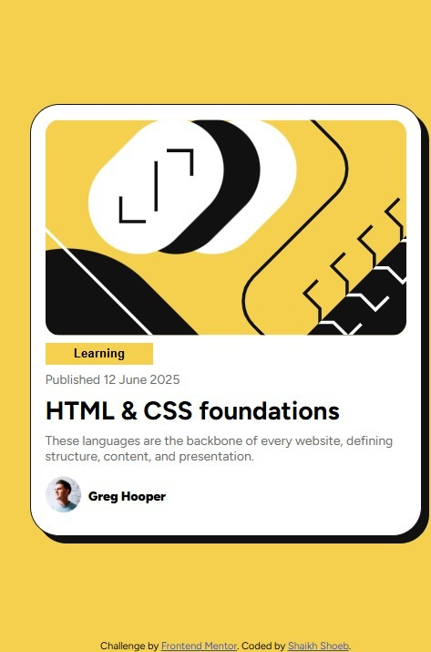
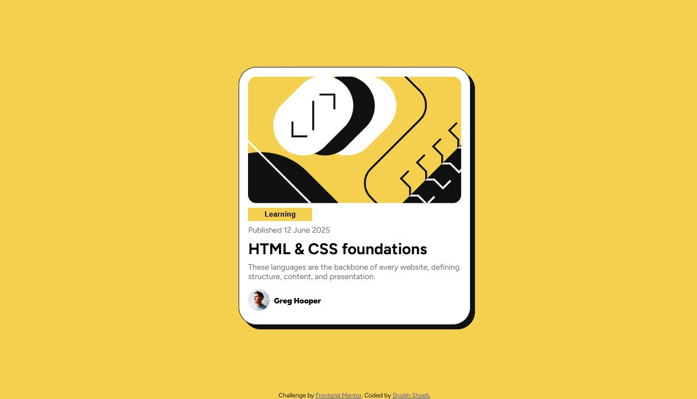
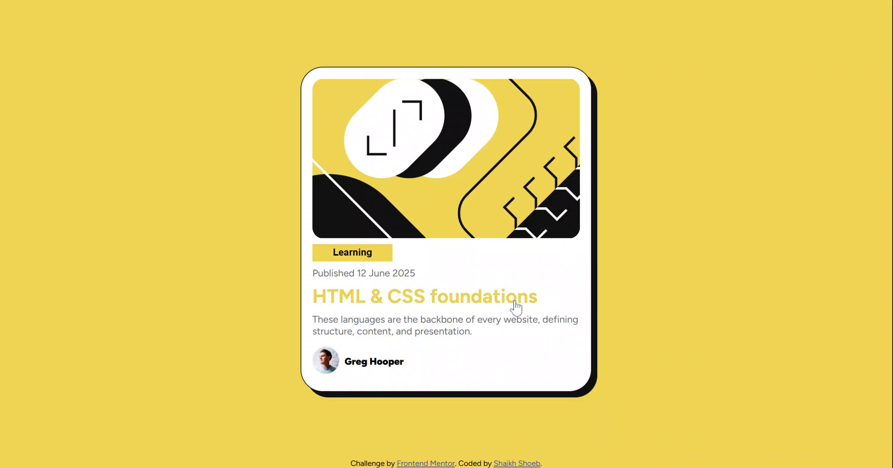

# Frontend Mentor - Blog preview card solution

This is a solution to the [Blog preview card challenge on Frontend Mentor](https://www.frontendmentor.io/challenges/blog-preview-card-ckPaj01IcS). Frontend Mentor challenges help you improve your coding skills by building realistic projects. 

## Table of contents

- [Overview](#overview)
  - [Screenshot](#screenshot)
  - [Links](#links)
  - [Useful resources](#useful-resources)
- [Author](#author)

## Overview

### Screenshot

### Links

- Solution URL: [Github Repository](https://github.com/it-Shoeb/Frontend-Mentor/tree/main/Newbie-Blog%20Preview%20Card%20Main)
- Live Site URL: [Live](https://blogpreviewcardmain-fm.netlify.app/)

### Useful resources

- [w3schools](https://www.w3schools.com/css/css3_fonts.asp) - I use first time fontface for includes or use font into my project using tff file. this is new for me.

## Author

- Frontend Mentor - [@it-Shoeb](https://www.frontendmentor.io/profile/it-Shoeb)
- Linkedin - [@shoebshaikh-its/](https://www.linkedin.com/in/shoebshaikh-its/)
- Github - [@it-Shoeb/](https://github.com/it-Shoeb/)
