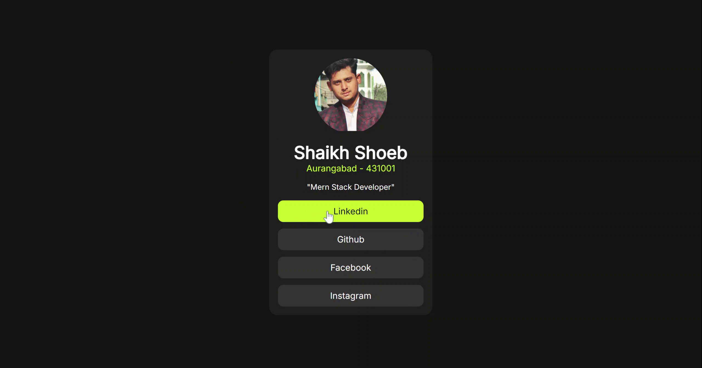

# Frontend Mentor - Social links profile solution

This is a solution to the [Social links profile challenge on Frontend Mentor](https://www.frontendmentor.io/challenges/social-links-profile-UG32l9m6dQ). Frontend Mentor challenges help you improve your coding skills by building realistic projects. 

## Table of contents

- [Overview](#overview)
  - [Screenshot](#screenshot)
  - [Links](#links)
  - [Author](#author)

### Screenshot

### Links

- Solution URL: [Github Repository](https://github.com/it-Shoeb/Frontend-Mentor/tree/main/Newbie-Social%20Link%20Profile)
- Live Site URL: [Live](https://sociallinkprofile-fm.netlify.app/)

## Author

- Frontend Mentor - [@it-Shoeb](https://www.frontendmentor.io/profile/it-Shoeb)
- Linkedin - [@shoebshaikh-its/](https://www.linkedin.com/in/shoebshaikh-its/)
- Github - [@it-Shoeb/](https://github.com/it-Shoeb/)